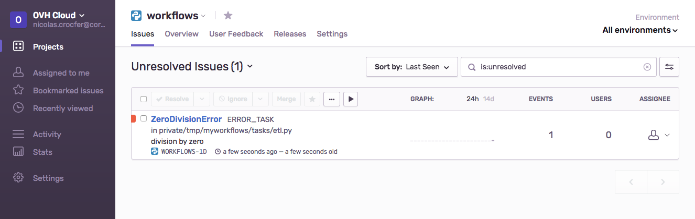
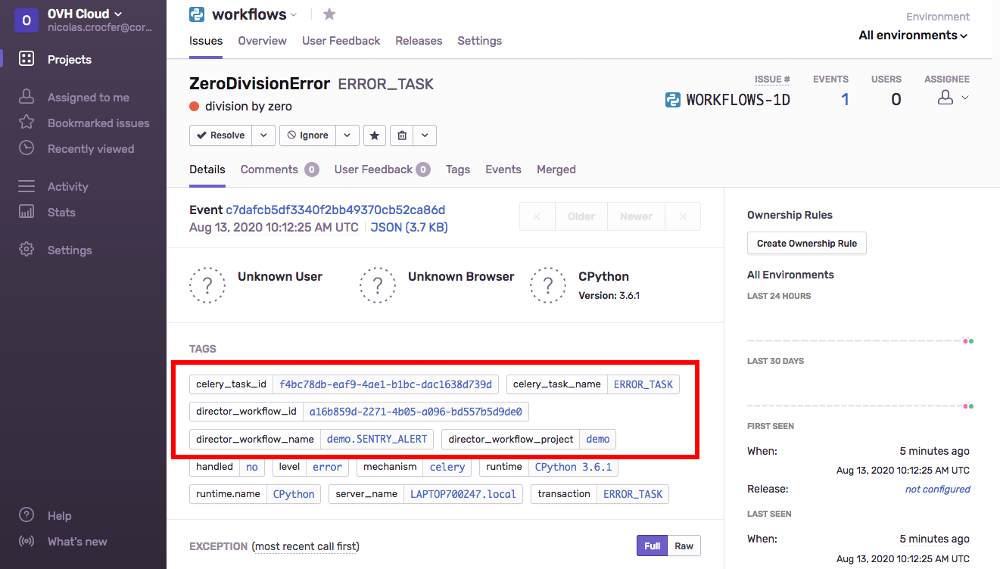
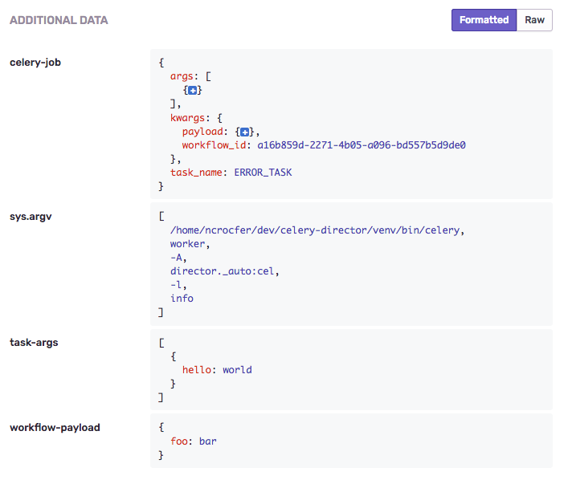

# Error Tracking

Director can send errors to [Sentry](https://docs.sentry.io/).

You can enable this feature by adding your `SENTRY_DSN` value in the `DIRECTOR_SENTRY_DSN` variable of the `.env` file :

```bash
DIRECTOR_SENTRY_DSN="https://xyz@sentry.example.com/0"
```

Let's imagine the following workflow :

```yaml
# workflows.yml
---
demo.SENTRY_ALERT:
  tasks:
    - WORKING_TASK
    - ERROR_TASK
```

With the associated tasks :

```python
# tasks/example.py
from director import task

@task(name="WORKING_TASK")
def working_task(*args, **kwargs):
    return {"hello": "world"}

@task(name="ERROR_TASK")
def error_task(*args, **kwargs):
    print(1/0)
```

When a Celery worker will execute this code, an issue will be created in Sentry with the `ZeroDivisionError` :



In order to group the issues by workflow's name or by project, Director associated some tags to the event :



Each event also contains additional data to better dig into the problem :

