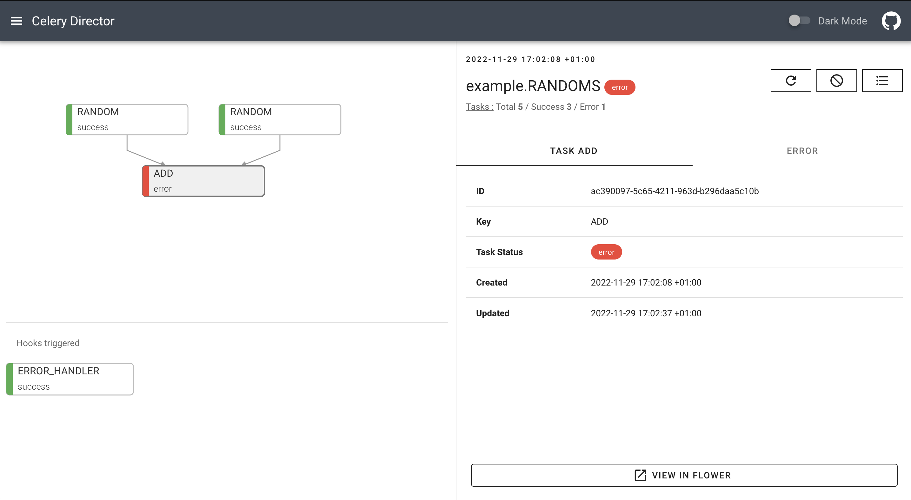

# Trigger Hooks

Director allows you to define a success and an error tasks in your workflows definitions. These tasks are called **hooks**, and they will be executed at the end of your workflows depending on their result.

You can define them in the `workflows.yml` file using the `hooks` key:

```yaml
example.ETL:
  tasks:
    - EXTRACT
    - TRANSFORM
    - LOAD
  hooks:
    failure: ERROR_HANDLER
    success: SUCCESS_HANDLER
```

These hooks are normal Celery tasks:

```python
@task(name="ERROR_HANDLER")
def error_handler(*args, **kwargs):
    print("I'm executed because the workflow failed")


@task(name="SUCCESS_HANDLER")
def success_handler(*args, **kwargs):
    print("I'm executed because the workflow succeeded")
```

Depending on the result of your workflows the corresponding hook will be called:

