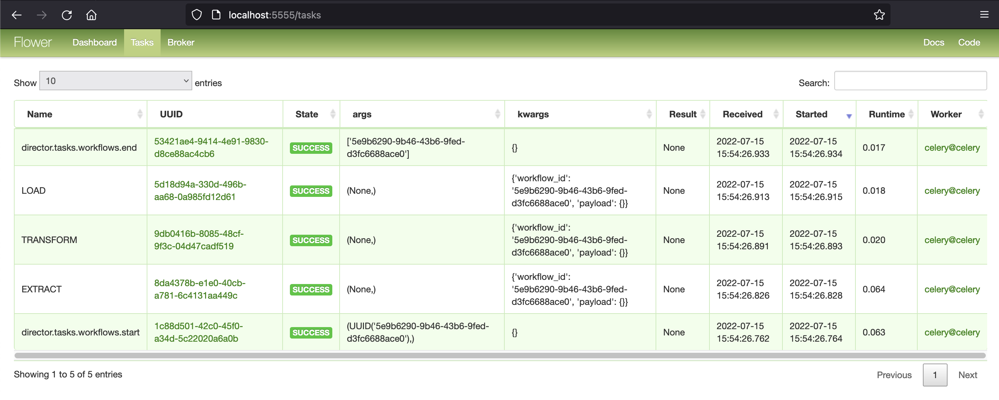

# Use Flower

Flower is a web-based tool used to monitor and manage your Celery clusters.

While Celery Director allows you to manage your entire workflows, Flower is able to give you more information at the task-level.

It can also let you control your workers and their configuration (pool size, autoscale settings, terminate tasks...). Check the [documentation](https://flower.readthedocs.io/en/latest/) for the full list of features.

!!!tip
    So Flower is a great tool to use in parallel with Celery Director if you need more control of your tasks and your Celery clusters.

## Launch Flower

The Flower tool is already included into Celery Director, so you just have to launch the following command to enable it:

```
$ director celery flower
```

You can now open [http://localhost:5555](http://localhost:5555) to track your tasks:

