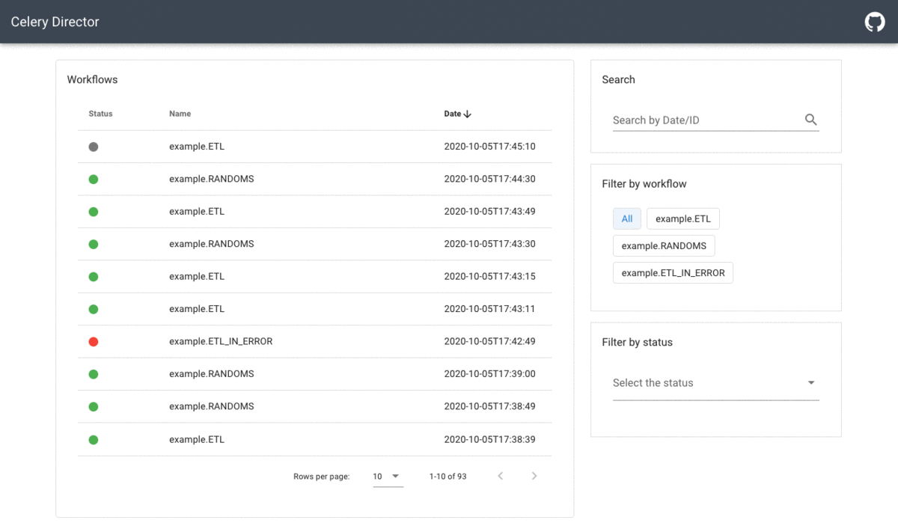

# Celery Director Documentation

Director is a simple and rapid framework used to manage tasks and build workflows using Celery.



## Features

The objective is to make Celery easier to use by providing :

- a WebUI to track the tasks states,
- an API and a CLI to manage and execute the workflows,
- a YAML syntax used to combine tasks into workflows,
- the ability to periodically launch a whole workflow,
- and many others.

!!! info
    Director is built on top of the excellent [Celery library](http://docs.celeryproject.org/en/latest/index.html).
    All the orchestration engine has not been changed : we didn't want to reinvent the wheel but
    provide an easy tool to use Celery.

    It means that all your existing tasks can easily be migrated to Director. Furthermore the
    documentation of the tasks and all the features powered by Celery like the **rate limiting**,
    the **task exception retrying** or even the **queue routing** stay the same.


## Installation

Install the latest version of Director with pip (requires `Python 3.6` at least):

```bash
pip install celery-director
```

## Usage

### Write your code in Python

```python
# tasks/orders.py
from director import task
from .utils import Order, Mail

@task(name="ORDER_PRODUCT")
def order_product(*args, **kwargs):
    order = Order(
      user=kwargs["payload"]["user"],
      product=kwargs["payload"]["product"]
    ).save()
    return {"id": order.id}

@task(name="SEND_MAIL")
def send_mail(*args, **kwargs):
    order_id = args[0]["id"]
    mail = Mail(
      title=f"Your order #{order_id} has been received",
      user=kwargs["payload"]["user"]
    )
    mail.send()
```

### Build your workflows in YAML

```yaml
# workflows.yml
product.ORDER:
  tasks:
    - ORDER_PRODUCT
    - SEND_MAIL
```

### Run it

You can simply test your workflow in local :

```bash
$ director workflow run product.ORDER '{"user": 1234, "product": 1000}'
```

And run it in production using the director API :

```bash
$ curl --header "Content-Type: application/json" \
  --request POST \
  --data '{"project": "product", "name": "ORDER", "payload": {"user": 1234, "product": 1000}}' \
  http://localhost:8000/api/workflows
```

## Project layout

    .env                # The configuration file.
    workflows.yml       # The workflows definition.
    tasks/
        example.py      # A file containing some tasks.
        ...             # Other files containing other tasks.

## Commands

* `director init [path]` - Create a new project.
* `director celery [worker|beat|flower]` - Start Celery daemons.
* `director webserver` - Start the webserver.
* `director workflow [list|show|run]` - Manage your project workflows.
